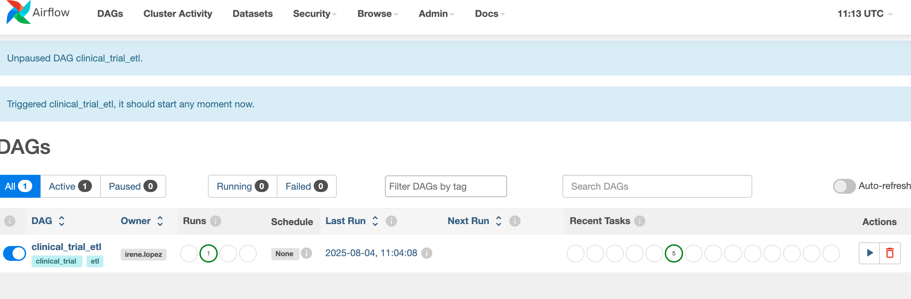
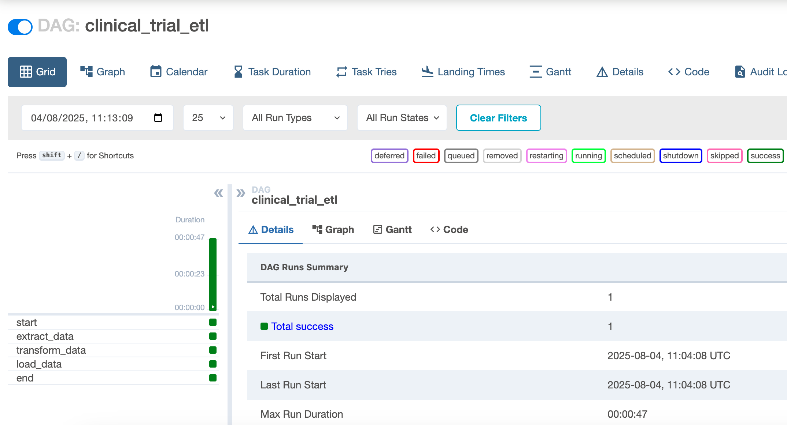
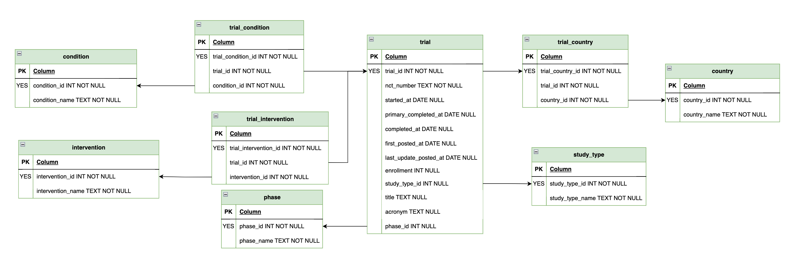

# 🧬 Clinical Trials Data Pipeline

This project implements a modular, production-style data pipeline that ingests a [COVID-19 Clinical Trials dataset](https://www.kaggle.com/datasets/parulpandey/covid19-clinical-trials-dataset) from Kaggle, loads it into a PostgreSQL database, transforms it into an efficient storage schema, and checks the resulting data quality.

The goal is to ensure **traceability**, **data quality**, and a **clean, reproducible architecture**.

---


## 🛠️ 1. Technologies Used

- **PostgreSQL** – data warehouse
- **Apache Airflow** – orchestrator for ETL workflow
- **DBT (Data Build Tool)** – transformations and data modeling
- **Docker Compose** – container orchestration
- **Python** – custom ETL extraction logic

---

## 📂 2. Project Structure

- **airflow_logs**: Docker-mounted volume for saving Airflow logs.
- **data**: folder with the raw CSV file [COVID-19 Clinical Trials dataset](https://www.kaggle.com/datasets/parulpandey/covid19-clinical-trials-dataset), downloaded from Kaggle.
- **init_db**: PostgreSQL init script (roles, users, schemas, production tables)
- **flow**: 
  - **dag** Airflow DAG definition with the ETL.
  - **src** Python scripts (ETL + DBT execution logic)
    - `extract.py`: extract all the CSV files in **data** folder by batches and load them in database on schema `raw`.
    - `execute_dbt.py`: execute the DBT commands to transform, test and load the source data.
    - **dbt_project** DBT project with models, tests and profiles for the pipeline Transformation and Load.
- **docker-compose.yml**: containers definition to execute the pipeline:
    - `postgres`: creates a postgres DB and initiatializes it with the `init_db/init.sql` script
    - `airflow`: webserver with DAG UI access at [http://localhost:8080](http://localhost:8080). **User and password** are both `admin`.
    - `airflow-scheduler`: starts the DAG scheduler after webserver is ready.

---


## 📌 3. Design Decisions & Trade-offs TODO


### 1. Architecture

Docker is used to manage dependencies and make the pipeline easily portable. The three main services are:

- **Postgres**: initialized with users, schemas, and security roles.
- **Airflow webserver**: accessible via browser with pre-created admin user at [http://localhost:8080](http://localhost:8080). **User and password** are both `admin`.
- **Airflow scheduler**: required to trigger DAGs.

### 2. ETL 

Even for this small use case, Airflow was chosen due to its scalability and ability to grow with future complexity. 

As mentioned before, Airflow Webserver can be accessed by user once the Docker container have been initialized. 
Just access [http://localhost:8080](http://localhost:8080). After prompting **User and password**  (both `admin`) you should see something like this:



The pipeline is divided into **three tasks**, each mapped to a different schema.

Here is a proof that the pipeline was correctly executed:




#### Extract

A Python script loads all the CSV sources in the `data` folder into the `raw` schema of Postgres DB by batches.
This can also be done with more directly using `pandas.to_sql()` but an internal function was created since data 
types can be difficult to handle with this pre-built functions.

A final Test is executed after the load to check if the created table has same rows as the CSV file with the source data. 
If these numbers do not match, then an error is raised and the whole ETL fails.

#### Transform 

Both Transformation and Load are done thorugh a DBT project that is executed thorugh Airflow.

DBT was used for its facility when defining transformation by SQL statements directly.

Transformation takes place on the `staging` schema, where copies of the tables in `prod` schema are created (along with some auxiliar tables).

Some important standarizations on the Transformation layer:
- PKs: the fields that will be used as PKs in the `prod` schema are created through an MD5 hash of the unique fields of the table.
- Date standardizations: date columns have been standarize according to the following logic:
  - When `Month DD, YYYY` (e.g. *February 1, 2022*): consider all fields.
  - When `Month YYYY` (e.g. *February 2022*): assume 1st day of the month
  - When `Month YYYY D` (e.g. *February 2022 1*): reordered into proper date
- Conidition standardizations. This column changes a lot thorugh the different records, but a normalization was done in the most frequent categories considering:
  - All records with a REGEX matching `'covid'` wwill refer to `'COVID-19'`
  - All records with a REGEX matching `'(sars.cov.*2)|corona.*virus'` wwill refer to `'SARS-CoV-2'`
- Intervention categories. Extracted as the text previous to the `:` character.

Tests on uniqueness, completeness and consistency are run on `staging` before moving data to production.

#### Load

Load is also done with the DBT project.

In this case, data from `staging` tables are moved to `prod` tables incrementally. **Tables are not created** this time, just new rows are inserted, since ETL should 
be able to work with the restrictions (PK, FK, data types) of the tables already created in the Postgres database.


### 3. Database design

The final `prod` schema on the DB was designed with the main purpose of answering the **expected analytics**:

> Your pipeline should be able to answer questions like:
> - How many trials by study type and phase?
> - What are the most common conditions being studied?
> - Which interventions have the highest completion rates?
> - Geographic distribution of clinical trials
> - Timeline analysis of study durations

Other data that might be useful was left out of the final schema since it was not the scope ot this pipeline design exercise.

The DB schema design can be seen [here](https://drive.google.com/file/d/1lqR85iQlu4p_BjoyYy3lPRH_zLqXvT7N/view?usp=sharing). 
Alternatively, you can check out this screenshot




This design was the result of the exploratory analysis done on the `raw` schema with the loaded data, that showed some nullables columns,
1 to N relations, fields that needed standarizations, etc.

Also different roles were created to ensure a basic level of security and compliance to avoid users (or processes) to interact with the data that they are not related to.

| User                         | Role | Permissions |
|-----------------------------|--------|----|
| admin|superuser|Full DB access and permissions|
|etl | dataops| Read/write access to raw, staging, prod|
|analyst|	analytics	|Read-only access to prod schema|


---


## ⚙️ 4. Setup Instructions

### 1. Install Docker

Only software that needs to be installed is Docker. Please visit this [official website]( https://www.docker.com/get-started/) to download and install it in your computer.

### 2. **Clone this repository**:

Now clone this repository to your local PC. Simply open a terminal and:

```bash
git clone https://github.com/irlorui/clinical_trial_etl.git
```

That's it! You are ready to run this pipeline! 🚀🚀🚀

-- 


## 🚀 5. Run the project

Finally, open a terminal in the folder with the cloned repository and execute this command for docker to create all the contaniners according to the definition.

```bash
docker compose up --build
```

Remember after Airflow-webserver is initialized, you can visit the Airflow UI at http://localhost:8080. Remember to use:
- User: admin
- Password: admin


The pipeline (`clinical_trial_etl`) will be triggered automatically by the trigger-dag service and you will be able to follow the execution of each step.

--- 


## ⏱️ 6. Time Allocation

| Task                         | Time Spent |
|-----------------------------|------------|
| Basic Architecture & Docker setup | 1.0h |
| PostgreSQL schema + roles   | 0.5h       |
| ETL logic                   | 1.5h       |
| Dashboard visualitation     | 0.5h       |
| Fix architecture and orchestration  | 1.0h  |
| Documentation               | 0.5h       |
| **Total**                   | **~5h**    |

---


## 💬 7. Bonus Questions

### 1. **Scalability**

How would you modify your solution to handle 100x more data volume?

- Change ETL to an incremental loads methodology using timestamps.
- Related to the previous one, parallelize tasks via Airflow for a more efficient pipeline.
- Add table partitioned tables.

### 2. **Data Quality**

What additional data validation rules would you implement for clinical trial data?

- Check logical timeline (e.g., start_date < completion_date).
- Detect and flag duplicates or conflicting entries.
- Deduplicate based on trial ID + country + phase.
- Standardize more the categorical fields (e.g., condition).

### 3. **Compliance (GxP environment)**

If this were a GxP environment, what additional considerations would you need?

- Implement strict version control logs on the code.
- Document and validate all steps of ETL.
- Add audit logging for each step of the transformation.

### 4. **Monitoring**

How would you monitor this pipeline in production?

A basic level of monitoring can be done through Airflow UI (http://localhost:8080) that can be used with this code. However a more robust pipeline should include:

- Alerting failures on the execution, preferably by email/Slack.
- Alerting also of the anomalies found with Data Quality tests at least on a data quality issues. If the anomalies are severe, use email/Slack as well.
- Store ETL metadata in DB so a dashboard can be created showing number of executions, retries, timeline, time estimations for new executions, etc.


### 5. **Security**

What security measures would you implement for sensitive clinical data?

- Store credentials securely using Docker secrets or environment variables. Actually, an even better solution would be to use a password manager like (Vault)[https://pypi.org/project/pyvault/] for the DB credentials that the ETL should use.
- Avoid downloading locally source files
- Discard completely (or encrypt if data is needed) any personal information the dataset might contain like names, phone numbers, emails, etc.
- Restrict user permissions

---


## 📎 Future Improvements

- Streamlit dashboard for reporting.
- Extend extraction scope to consider data from multiple sources besides CSV files; JSON APIs, SQL databases, plain text files, etc.
- Include data quality tests on production
